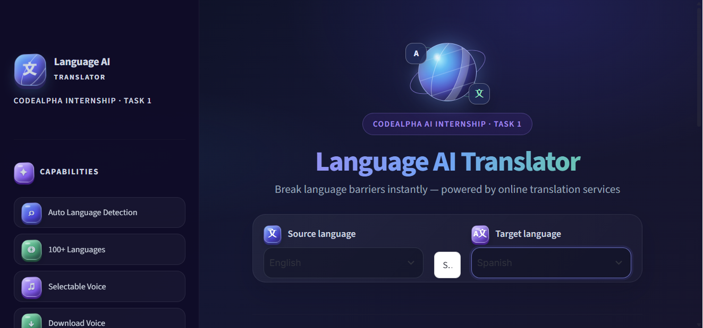
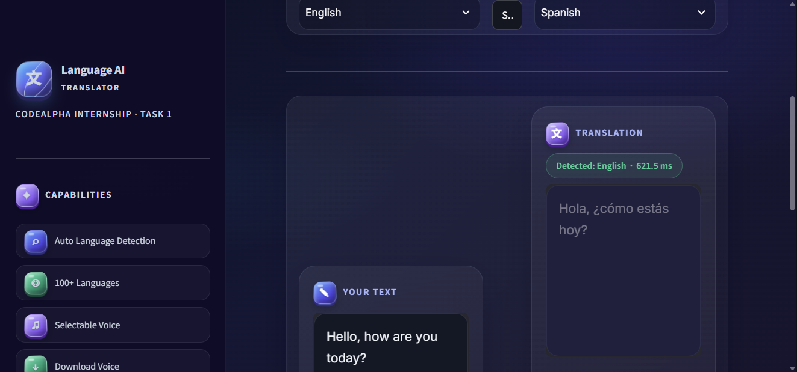
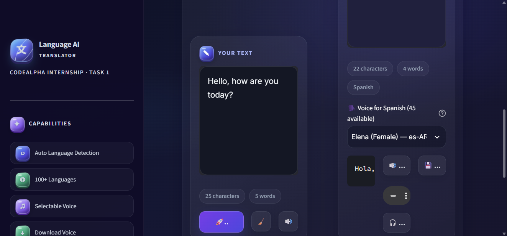

# 🌐 YashLingua Translator

<div align="center">


**Real-time AI-powered Language Translation Tool**
*CodeAlpha Artificial Intelligence Internship — Task 1*

</div>

---

## 📌 Overview

**YashLingua Translator** is a full-featured language translation web application built as **Task 1** of the **CodeAlpha AI Internship**. It translates text across 100+ languages with a Streamlit interface, audio playback, speech downloads, and spelling and grammar suggestions.

Translation uses Google's **unofficial, undocumented web translation endpoint** as the primary provider and MyMemory as a fallback. Text correction uses LanguageTool's online API only when you click **Auto-correct**; the text you submit is sent to that service. These public services may impose limits or change without notice. The welcome screen is a guest entry screen, not an authentication system.

---

## ✨ Features

| Feature | Description |
|---------|-------------|
| 🌍 **100+ Languages** | Translate between any of 100+ world languages |
| 🔍 **Auto Language Detection** | Automatically detects the source language |
| ✨ **Auto-correct** | Request spelling and grammar suggestions for the input text from LanguageTool |
| 👋 **Guest welcome screen** | Start at a welcome page and continue into the translator without creating an account |
| 🔊 **Text-to-Speech (TTS)** | Listen to original text via gTTS and translated text with selectable neural voices |
| 🗣️ **Voice Selection** | Choose from all neural voices available for the selected translation language; counts vary by language |
| 🎧 **Download Voice** | Download generated translated speech as an MP3 file |
| ⇄ **Swap Languages** | Instantly swap source & target languages + text |
| 📋 **Copy to Clipboard** | One-click copy of translated text |
| 💾 **Download as .txt** | Download translation as a text file |
| 📜 **Session History** | View your recent translations in the sidebar |
| 🧭 **Sidebar shortcuts** | Click a feature name to jump directly to its language, swap, translation, or history section |
| ⚡ **Latency Display** | Shows how fast the translation was in ms |
| 🎨 **Dark dashboard UI** | Dashboard-style layout with responsive dark panels |
| 🔄 **Fallback provider** | Tries MyMemory when the primary unofficial endpoint is unavailable |
| 🧊 **3D-style interface** | Animated globe, dimensional icons, and responsive dark-mode panels |

---

## 🖼️ Screenshots

### Main interface


### Language selection


### Translation output


### Text-to-speech


---

## 🛠️ Tech Stack

- **Python 3.13**
- **Streamlit** — Web UI framework
- **Google unofficial web endpoint** — Primary translation provider (not Google Cloud Translation API)
- **MyMemory API** — Fallback translation
- **LanguageTool HTTP API** — Optional spelling and grammar correction for submitted text
- **gTTS** — Text-to-Speech audio generation
- **Edge TTS** — Selectable online neural voices for translated speech
- **pyttsx3** — Offline TTS engine (Desktop version)
- **CustomTkinter** — Desktop GUI (alternative version)
- **httpx** — HTTP client with request timeouts

---

## 🚀 Getting Started

### 1. Clone the Repository
```bash
git clone https://github.com/yashsagrosaniya123/CodeAlpha-Task1-Language-Translator.git
cd CodeAlpha-Task1-Language-Translator
```

### 2. Install Web App Dependencies
```bash
pip install -r requirements.txt
```

For deterministic tests, install `requirements-dev.txt`. For the optional desktop application, install `requirements-desktop.txt` instead.

### 3. Run the Web App
```bash
python -m streamlit run app.py
```

### 4. Run the Desktop App (Alternative)
```bash
python desktop_app.py
```

## ☁️ Deploy on Streamlit Community Cloud

1. Push this repository to your GitHub account.
2. In Streamlit Community Cloud, create an app from the repository's `main` branch and select `app.py`.
3. Select Python 3.13 and deploy. Community Cloud installs the pinned web dependencies from `requirements.txt`.
4. Translation and online speech features need an internet connection and may be limited by their third-party providers.

The app and dependency set are smoke-tested locally. A deployment on Streamlit Community Cloud has **not** been performed or verified by this project.

---

## 📁 Project Structure

```
CodeAlpha-Task1-Language-Translator/
│
├── app.py                  # 🌐 Streamlit Web Application
├── speech_service.py       # 🔊 Online and Google TTS adapters
├── desktop_app.py          # 🖥️ CustomTkinter Desktop App
├── translator_engine.py    # ⚙️ Core Translation Engine
├── test_translator.py      # 🧪 Unit Tests (pytest)
├── requirements.txt        # 📦 Pinned web dependencies
├── requirements-dev.txt    # 🧪 Pinned test dependencies
├── requirements-desktop.txt # 🖥️ Optional desktop dependencies
├── screenshots/            # 🖼️ App screenshots
├── .gitignore              # 🚫 Git Ignore Rules
├── LICENSE                 # 📄 MIT License
└── README.md               # 📖 Documentation
```

---

## 🧪 Run Tests

```bash
python -m pip install -r requirements-dev.txt
python -m pytest test_translator.py -v
```

---

## 📦 Requirements

Web, development, and optional desktop dependencies are pinned in `requirements.txt`, `requirements-dev.txt`, and `requirements-desktop.txt`.

---

## 📄 License

This project is licensed under the **MIT License** — see the [LICENSE](LICENSE) file for details.

---

## 👤 Author

**Yash Sagrosaniya**
📧 sagrosaniyayash234@gmail.com
🎓 CodeAlpha AI Internship — Task 1

---

<div align="center">
  Made with ❤️ for <b>CodeAlpha Artificial Intelligence Internship</b>
</div>
